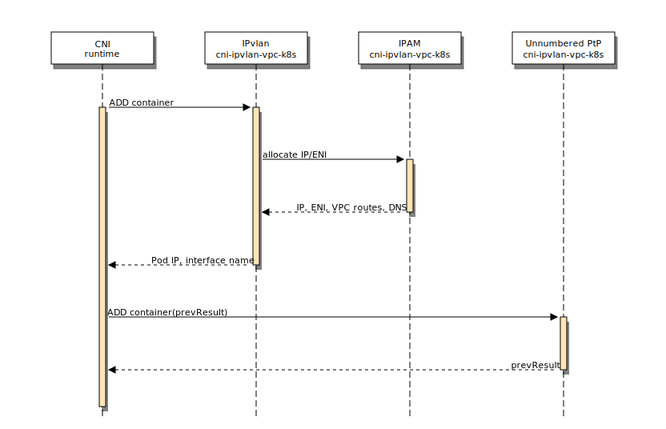
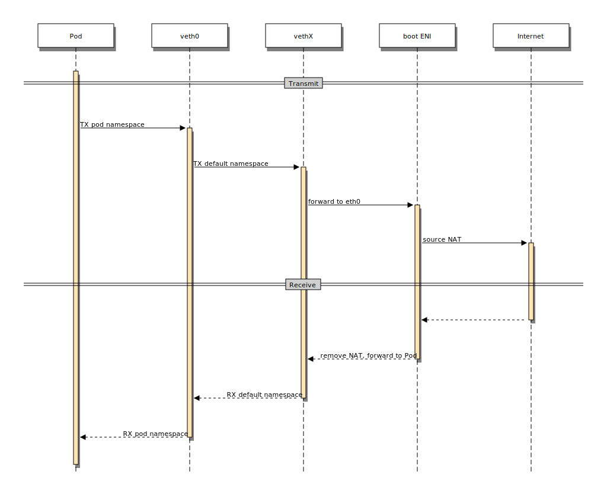

# cni-ipvlan-vpc-k8s: IPvlan Overlay-free Kubernetes Networking in AWS

`cni-ipvlan-vpc-k8s` contains a set of
[CNI](https://github.com/containernetworking/cni) and IPAM plugins to
provide a simple, host-local, low latency, high throughput, and [compliant
networking stack for
Kubernetes](https://kubernetes.io/docs/concepts/cluster-administration/networking/#kubernetes-model)
within [Amazon Virtual Private Coud
(VPC)](https://aws.amazon.com/vpc/) environments by making use of
[Amazon Elastic Network Interfaces
(ENI)](http://docs.aws.amazon.com/AWSEC2/latest/UserGuide/using-eni.html)
and binding AWS-managed IPs into Pods using the Linux kernel's IPvlan
driver in L2 mode.

The plugins are designed to be straightforward to configure and deploy
within a VPC. Kubelets boot and then self-configure and scale their IP
usage as needed, without requiring the often recommended complexities
of administering overlay networks, BGP, disabling source/destination
checks, or adjusting VPC route tables to provide per-instance subnets
to each host (which is limited to 50-100 entries per VPC). In short,
`cni-ipvlan-vpc-k8s` significantly reduces the network complexity
required to deploy Kubernetes at scale within AWS.

The maximum number of Pods per AWS instance is determined by [ENI
limits](https://docs.aws.amazon.com/AWSEC2/latest/UserGuide/using-eni.html#AvailableIpPerENI). Instance
types offering 8 ENIs can scale up to and beyond the default
Kubernetes limit of 110 pods per instance.

## Features

* Designed and tested on Kubernetes in AWS (v1.10 with CRI-O and Docker)
* No overlay network; very low overhead with IPvlan
* No external or local network services required outside of the AWS
  EC2 API; host-local scale up and scale down of network resources
* Unnumbered point-to-point interfaces connect Pods with their Kubelet
  and Daemon Sets using their well-known Kubernetes IPs and optionally
  provide IPv4 internet connectivity via NAT by directing traffic over
  the primary private IP of the boot ENI making use of Amazon's Public
  IPv4 addressing attribute feature.
* No asymmetric routing; no VPC routing table changes required
* Pod IPs are directly addressable from non-Kubernetes VPC
  hosts, easing migration of existing pre-Kubernetes service meshes
  and infrastructure.
* Automatic discovery of AWS resources, minimal plugin configuration
  required.

## How it Works

The primary EC2 boot ENI with its primary private IP is used as the IP
address for the node. Our CNI plugins manage additional ENIs and
private IPs on those ENIs to assign IP addresses to Pods.

Each Pod contains two network interfaces, a primary IPvlan interface
and an unnumbered point-to-point virtual ethernet interface. These
interfaces are created via a chained CNI execution.



* IPvlan interface: The IPvlan interface with the Pod’s IP is used for
  all VPC traffic and provides minimal overhead for network packet
  processing within the Linux kernel. The master device is the ENI of
  the associated Pod IP. IPvlan is used in L2 mode with isolation
  provided from all other ENIs, including the boot ENI handling
  traffic for the Kubernetes control plane.
* Unnumbered point-to-point interface: A pair of virtual ethernet
  interfaces (veth) without IP addresses is used to interconnect the
  Pod’s network namespace to the default network namespace. The
  interface is used as the default route (non-VPC traffic) from the
  Pod and additional routes are created on each side to direct traffic
  between the node IP and the Pod IP over the link. For traffic sent
  over the interface, the Linux kernel borrows the IP address from the
  IPvlan interface for the Pod side and the boot ENI interface for the
  Kubelet side. Kubernetes Pods and nodes communicate using the same
  well-known addresses regardless of which interface (IPvlan or veth)
  is used for communication. This particular trick of “IP unnumbered
  configuration” is documented in
  [RFC5309](https://tools.ietf.org/html/rfc5309).

### Internet egress
For applications where Pods need to directly communicate with the
Internet, by setting the default route to the unnumbered
point-to-point interface, our stack can source NAT traffic from the
Pod over the primary private IP of the boot ENI, which enables making
use of Amazon’s Public IPv4 addressing attribute feature. When
enabled, Pods can egress to the Internet without needing to manage
Elastic IPs or NAT Gateways.




### Host namespace interconnect
Kubelets and Daemon Sets have high bandwidth, host-local access to all
Pods running on the instance — traffic doesn’t transit ENI
devices. Source and destination IPs are the well-known Kubernetes
addresses on either side of the connect.

* kube-proxy: We use kube-proxy in iptables mode and it functions as
  expected. The Pod's source IP is retained -- Kubernetes Services see
  connections from the Pod's source IP. The unnumbered point-to-point
  interface is used to loop traffic between kube-proxy in the default
  namespace for outbound connections created in the Pod namespace.
* [kube2iam](https://github.com/jtblin/kube2iam): Traffic from Pods to
  the AWS Metadata service transits over the unnumbered point-to-point
  interface to reach the default namespace before being redirected via
  destination NAT. The Pod’s source IP is maintained as kube2iam runs
  as a normal Daemon Set.

### VPC optimizations

Our design is heavily optimized for intra-VPC traffic where IPvlan is
the only overhead between the instance’s ethernet interface and the
Pod network namespace. We bias toward traffic remaining within the VPC
and not transiting the IPv4 Internet where veth and NAT overhead is
incurred. Unfortunately, many AWS services require transiting the
Internet; however, both DynamoDB and S3 offer VPC gateway endpoints.

While we have not yet implemented IPv6 support in our CNI stack, we
have plans to do so in the near future. IPv6 can make use of the
IPvlan interface for both VPC traffic as well as Internet traffic, due
to AWS’s use of public IPv6 addressing within VPCs and support for
egress-only Internet Gateways. NAT and veth overhead will not be
required for this traffic.

We’re planning to migrate to a VPC endpoint for DynamoDB and use
native IPv6 support for communication to S3. Biasing toward extremely
low overhead IPv6 traffic with higher overhead for IPv4 Internet
traffic is the right future direction.

# Using with Kubernetes

## Supported container runtimes

`cni-ipvlan-vpc-k8s` is used in production at Lyft with cri-o for
non-GPU workloads and Docker w/ nvidia-docker for GPU workloads.

Note that for cri-o, `manage_network_ns_lifecycle` *must* be set to
true.

## Prerequisites

1. By default, we use a secondary (and tertiary, ...) ENI adapter for
   all Pod networking. This allows isolation by security groups or
   other constraints on the Kubelet control plane. This requires that
   the hosts you are running on can attach at least two ENI
   adapters. See:
   http://docs.aws.amazon.com/AWSEC2/latest/UserGuide/using-eni.html
   Most hosts support > 1 adapter, except for some of the smallest
   hardware types.
1. AWS VPC with a recommended minimum number of subnets equal to the
   maximum number of attached ENIs. In the normal case of supporting
   up to the default 110 Pods per instance, you'll want five subnets
   (one for the control plane on the boot ENI and four subnets for the
   Pod ENIs). The example configuration uses adapter index 1 onward
   for Pods. We recommend creating a secondary IPv4 CIDR block for
   Kubernetes deployments within existing VPCs and subnet
   appropriately for the number of ENIs.  In our primary region, we
   divide up our secondary IPv4 CIDR (/16) into 5 /20s per AZ with 3
   AZs. Datadog has provided code which removes the restriction on one
   subnet per ENI; however, we've yet to test it thoroughly at Lyft.
1. (Optional) AWS subnets tagged if you want to limit which ones can
   be used.
1. The `kubelet` process _must_ be started with the `--node-ip` option
   if you also use `--cloud-provider=aws`. Use the primary IP on
   the boot ENI adapter (eth0).
1. AWS permissions allowing at least these actions on the _Kubelet_ role:

        "ec2:DescribeSubnets"
        "ec2:AttachNetworkInterface"
        "ec2:AssignPrivateIpAddresses"
        "ec2:UnassignPrivateIpAddresses"
        "ec2:CreateNetworkInterface"
        "ec2:DescribeNetworkInterfaces"
        "ec2:DetachNetworkInterface"
        "ec2:DeleteNetworkInterface"
        "ec2:ModifyNetworkInterfaceAttribute"
        "ec2:DescribeVpcs"
        "ec2:DescribeVpcPeeringConnections"

    ec2:DescribeVpcs is required for m5 and c5 instances because the AWS metadata
    server does not return the secondary CIDR block on these instance types. This 
    requirement will be removed when the issue is fixed.

    ec2:DescribeVpcPeeringConnections is only required if routeToVpcPeers is
    enabled on the plugin.

    See [Security Considerations](#security-considerations) below for more on
    the implications of these permissions.


## Building

cni-ipvlan-vpc-k8s requires `dep` for dependency management. Please see
https://github.com/golang/dep#setup for build instructions. In a
pinch, you may `go get -u github.com/golang/dep/cmd/dep`.

    go get github.com/lyft/cni-ipvlan-vpc-k8s
    cd $GOPATH/src/github.com/lyft/cni-ipvlan-vpc-k8s
    make build

## Example Configuration

This example CNI conflist creates Pod IPs on the secondary and above
ENI adapters and chains with the upstream ipvlan plugin (0.7.0 or
later required) and the `cni-ipvlan-vpc-k8s-unnumbered-ptp` plugin to
create unnumbered point-to-point links back to the default namespace
from each Pod. New interfaces will be attached to subnets tagged with
`kubernetes_kubelet` = `true`, and created with the defined security
groups.

Routes are automatically formed for the VPC on the `ipvlan` adapter.

ipMasq is enabled to use the host-IP for egress to the Internet as
well as providing access to services such as `kube2iam`. `kube2iam` is
not a dependency of this software.

```
{
    "cniVersion": "0.3.1",
    "name": "cni-ipvlan-vpc-k8s",
    "plugins": [
	{
	    "cniVersion": "0.3.1",
	    "type": "cni-ipvlan-vpc-k8s-ipam",
	    "interfaceIndex": 1,
	    "subnetTags": {
		"kubernetes_kubelet": "true"
	    },
	    "secGroupIds": [
		"sg-1234",
		"sg-5678"
	    ]
	},
	{
	    "cniVersion": "0.3.1",
	    "type": "cni-ipvlan-vpc-k8s-ipvlan",
	    "mode": "l2"
	},
	{
	    "cniVersion": "0.3.1",
	    "type": "cni-ipvlan-vpc-k8s-unnumbered-ptp",
	    "hostInterface": "eth0",
	    "containerInterface": "veth0",
	    "ipMasq": true
	}
    ]
}
```

### Other configuration flags

In the above `cni-ipvlan-vpc-k8s-ipam` config, several options are
available:

 - `interfaceIndex`: We also recommend never using the boot ENI
   adapter with this plugin (though it is possible). By setting
   `interfaceIndex` to 1, the plugin will only allocate IPs (and add
   new adapters) starting at `eth1`.
 - `subnetTags`: When allocating new adapters, by default the plugin
   will use all available subnets within the availability zone. You
   can restrict which subnets the plugin will use by specifying key /
   value tag names that must be matched in order for the plugin to be
   considered. These tags are set via the AWS API or in the AWS
   Console on the subnet object.
 - `secGroupIds`: When allocating a new ENI adapter, these interface
   groups will be assigned to the adapter. Specify the `sg-xxxx`
   interface group ID.
 - `skipDeallocation`: `true` or `false` - when set to `true`, this
   plugin will never remove a secondary IP address from an
   adapter. Useful in workloads that churn many pods to reduce the AWS
   ratelimits for configuring the VPC (which are low and cannot be
   raised above a certain threshold). 
 - `routeToVpcPeers`: `true` or `false` - When set to `true`, the
   plugin will make a (cached) call to `DescribeVpcPeeringConnections`
   to enumerate all peered VPCs. Routes will be added so connections
   to these VPCs will be sourced from the IPvlan adapter in the pod
   and not through the host masquerade.
- `reuseIPWait`: Seconds to wait before free IP addresses are made
   available for reuse by Pods. Defaults to 60 seconds. `reuseIPWait`
   functions as both a lock to prevent addresses from being grabbed by
   Pods spinning up in between the stages of chained CNI plugin
   execution and as a method of delaying when a new Pod can grab the
   same IP address of a terminating Pod.


### IP address lifecycle management

As new Pods are created, if needed, secondary IP addresses are added
to secondary ENI adapters until they reach capacity. A lightweight
file-based registry stores hints containing free IP addresses
available to the instance to prevent unnecessary churn from adding and
removing IPs to and from ENI adapters, which is a fairly heavyweight
AWS process. By default, free IP addresses are made available for
reuse by Pods after being unused for at least 60 seconds. To handle
cases where IPs are not frequently reused by Pods, and an excess of
free IP addresses becomes available on an instance, a systemd timer is
recommended to garbage collect these old IPs.

Sample cni-gc.service:
```[Unit]
Description=Garbage collect IPs unused for 15 minutes

[Service]
Type=oneshot
ExecStart=/usr/local/bin/cni-ipvlan-vpc-k8s-tool registry-gc --free-after=15m
```

Sample cni-gc.timer:
```
[Unit]
Description=Run cni-gc every 5 minutes

[Timer]
OnBootSec=5min
OnUnitActiveSec=5min

[Install]
WantedBy=timers.target
```

## The CLI Tool

This plugin ships a CLI tool which can be useful to inspect the state
of the system or perform certain actions (such as provisioning an
adapter at instance cloud-init time).

Run `cni-ipvlan-vpc-k8s-tool --help` for a complete listing of
options.

    NAME:
       cni-ipvlan-vpc-k8s-tool - Interface with ENI adapters and CNI bindings for those

    USAGE:
       cni-ipvlan-vpc-k8s-tool [global options] command [command options] [arguments...]

    VERSION:
       v-next

    COMMANDS:
	 new-interface             Create a new interface
	 remove-interface          Remove an existing interface
	 deallocate                Deallocate a private IP
	 allocate-first-available  Allocate a private IP on the first available interface
	 free-ips                  List all currently unassigned AWS IP addresses
	 eniif                     List all ENI interfaces and their setup with addresses
	 addr                      List all bound IP addresses
	 subnets                   Show available subnets for this host
	 limits                    Display limits for ENI for this instance type
	 bugs                      Show any bugs associated with this instance
	 vpccidr                   Show the VPC CIDRs associated with current interfaces
	 vpcpeercidr               Show the peered VPC CIDRs associated with current interfaces
	 registry-list             List all known free IPs in the internal registry
	 registry-gc               Free all IPs that have remained unused for a given time interval
	 help, h                   Shows a list of commands or help for one command

    GLOBAL OPTIONS:
       --help, -h     show help
       --version, -v  print the version

    COPYRIGHT:
       (c) 2017-2018 Lyft Inc.


## Security Considerations

In Kubernetes, pods and kubelets are assumed to have static IP addresses that
are assigned for the lifetime of the object. However, the EC2 IAM permissions
required by `cni-ipvlan-vpc-k8s` enable authorized principals to manipulate
network interfaces and IP addresses, which could be used to remap IP addresses
and "take over" the IP address of an existing pod or kubelet. Such an IP
address takeover could allow impersonation of a pod or kubelet at the network
layer, and disrupt the availability of your Kubernetes cluster.

IP address takeovers are possible in the following situations:
* Compromise of a kubelet instance configured to run `cni-ipvlan-vpc-k8s` with
  the required IAM permissions.
* Use (or abuse) of the EC2 ENI and IP Address manipulation APIs by a user or
  service in your AWS account authorized to do so.

Consider taking the following actions to reduce the likelihood and impact of IP
takeover attacks:
* Limit the number of principals authorized to manipulate ENIs and IP
  addresses.
* Do not rely exclusively on the Kubernetes control plane to ensure you're
  connected to the pod you expect. Deploy mutual TLS (mTLS) or other end-to-end
  authentication to authenticate clients and pods at the application layer.

# Get Support: Mailing Lists and Chat

 * Announcement list - new releases will be announced here:
   https://groups.google.com/forum/#!forum/cni-ipvlan-vpc-k8s-announce
 * Users discussion list:
   https://groups.google.com/forum/#!forum/cni-ipvlan-vpc-k8s-users
 * Gitter discussion: https://gitter.im/lyft/cni-ipvlan-vpc-k8s
